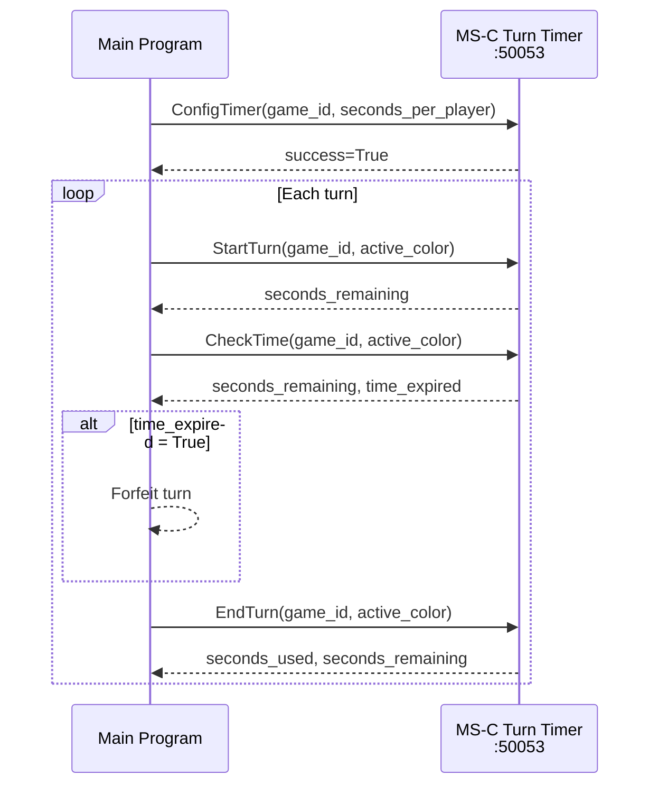

# Microservice C — Turn Timer
**CS 361 | Port 50053 | gRPC**

Manages a per-player countdown timer. Tracks time banks across turns and signals when a player's time expires.

---

## Setup

```bash
pip install grpcio grpcio-tools
python3 server.py
```

---

## Request

```python
import grpc, timer_pb2, timer_pb2_grpc

stub = timer_pb2_grpc.TurnTimerStub(grpc.insecure_channel("localhost:50053"))

# 1. Configure before the game starts
stub.ConfigTimer(timer_pb2.ConfigTimerRequest(
    game_id="game_001", seconds_per_player=300))

# 2. When a turn begins
stub.StartTurn(timer_pb2.StartTurnRequest(
    game_id="game_001", active_color="WHITE"))

# 3. Poll during a turn
response = stub.CheckTime(timer_pb2.CheckTimeRequest(
    game_id="game_001", active_color="WHITE"))

# 4. When a turn ends
stub.EndTurn(timer_pb2.EndTurnRequest(
    game_id="game_001", active_color="WHITE"))
```

## Response

```python
# CheckTime
response.seconds_remaining  # int  — seconds left in bank
response.time_expired       # bool — True if bank hit zero

# EndTurn
response.seconds_used       # int  — seconds used this turn
response.seconds_remaining  # int  — updated bank
```

---

## UML Sequence Diagram


